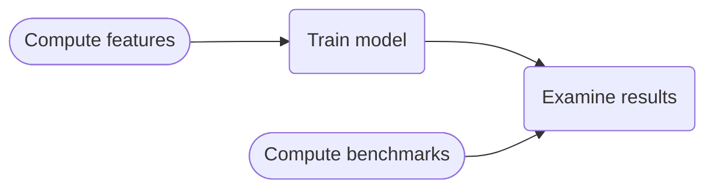

# MAGNET: MAGnitude Neural EsTimation model

This code implements MAGNET for magnitude prediction of earthquakes.
MAGNET is presented in the paper _Do earthquakes "know" how big they will be? a neural-net aided study_ https://doi.org/10.48550/arXiv.2408.02129 .

# Install

The package was tested using a python env created with conda package manager.
From the root of project, perform:

```
conda create --name <environment_name> --file requirements.txt python=3.11 -c conda-forge 
conda activate <environment_name> 
pip install --no-deps -e .
```

# Quick start
A tutorial for this package can be seen in the ```tutorial_run_this_first.ipynb``` notebook.

# Model training procedure

The general scheme of training a model using MAGNET is as follows:



_Compute features_ and _Compute benchmarks_ stages are performed separately from
the training process, results are cached and read during training or when
needed.

_Compute features,  Compute benchmarks_ and _Train model_ are executed by
scripts (see package structure below). 

A few examples of how to _Examine results_ are given in the `notebooks` directory.

# Package structure

Below is the detailed folder content

```
eq_mag_prediction
├── eq_mag_prediction # package code
│   ├── scripts       # meant for running from command line interface
│   ├── ingestion     # ingestion of catalogs
|   :
|
├── notebooks         # ipynb notebooks exemplifying functionality
└── results           # meant for storage of script results and pre trained models
    ├── cached_benchmarks
    ├── cached_features
    ├── catalogs
    │   ├── ingested
    │   └── raw
    └── trained_models
        ├── GeoNet_NZ
        ├── Hauksson
        └── JMA

```

## notebooks
ipynb notebooks exemplifying usage of model loading and result analysis.


## scripts

Scripts are meant for execution by CLI, after activating the workspace:

1.  `calculate_benchmark_gr_properties.py`: calculates and caches benchmarks for
    comparison.
2.  `magnitude_prediction_compute_features.py`: computes features for model
    training.
3.  `magnitude_predictor_trainer.py`: train a model.

By running
```
python3  path/to/script.py --help
```
A detailed description of the script and flags to be used will be presented.

> <span style="font-size:0.8em;"> Cached results from
> `calculate_benchmark_gr_properties.py` and
> `magnitude_prediction_compute_features.py` are named using hash code that
> indicates the exact inputs that were used to calculate them. The names
> themselves are not fully indicative, and are read using dedicated reading
> functions that search for the specific encoded names. </span>

### gin configurations
Running scripts require a ```config.gin``` file. These files define to specific parameters to be used in the executed run. These may include what catalog is used, the training period defined, hyperparameters for model training, etc. 
Some scripts are directed to a default gin configuration file.

For more details on how to use gin see:
https://github.com/google/gin-config?tab=readme-ov-file

## ingestion (a.k.a "Work on you own catalog")

In order to use a catalog with MAGNET it should be transformed from its 
raw format  into a standard format, this is the ***ingestion*** process.

The standard form which can be used by MAGNET can be seen in the mock catalog produced by the tutorial ```tutorial_run_this_first.ipynb```. 

Ingestion scripts for the catalogs we have worked on can be found in this code base, and are meant to be run via the command line interface. 
By default, ingestion scripts will look for the raw catalog in
`eq_mag_prediction/results/catalogs/raw` and cache the modified in
`eq_mag_prediction/results/catalogs/ingested`. In order to change this behavior
see flags in ingestion code itself.

> **Note on JMA:** The JMA catalog may be also ingested via a protobuf format (https://protobuf.dev/)
>instead of pythonically. See description of ```ingest_jma_via_proto.py``` for
>details.

> **Note on ingestion of major earthquakes catalogs:** ```pdfs_of_major_earthquakes.ipynb``` plots model's prediction for a list of
major earthquakes in the catalog region. By the notebook design,  the list of
major earthquakes are given by the ingested major earthquakes catalog, per
region. See description in ```ingest_***_major_earthquakes.py``` scripts.

### Catalog Downloads and Version Compatibility


For technical reasons, we cannot include the full raw catalogs in this code base. You can download the catalogs from the links below.

> **⚠️ Note on Hauksson Catalog (Southern California):**
The MAGNET model provided in this repository was trained and validated on the **2022 version** of the Hauksson catalog. The public catalog format has since changed.
>* **Legacy/Reproduction:** If you have access to the original 2022 file structure, use the standard `ingest_hauksson.py`.
> * **Modern Data:** If you download the *current* catalog from the link below, you must use `ingest_hauksson_new_format.py`. **Crucially, the pre-trained model weights are incompatible with the new catalog format.** To use the new data, you must retrain the model from scratch using the provided training scripts.

**Download Links:**

* Hauksson catalog for Southern California:<br> https://service.scedc.caltech.edu/ftp/catalogs/hauksson/Socal_focal/

*  JMA catalog for Japan:<br> 
https://www.data.jma.go.jp/svd/eqev/data/bulletin/hypo_e.html
* The New Zealand GeoNet catalog:<br> 
https://www.geonet.org.nz/data/types/eq_catalogue


## results

The `results` directory serves as the default storage and cache location for trained models, calculated benchmarks, extracted features, and ingested catalogs.

To keep this repository lightweight, the trained models and computed benchmarks are **not included** in the git history. Instead, they are hosted externally as a complementary dataset.

⚠️ **To recreate the results presented in the publication** without retraining models from scratch, you must download the full `results` directory content from Zenodo:

* **Pre-trained Models & Benchmarks:** [https://zenodo.org/records/13387662](https://zenodo.org/records/13387662)

**Setup:** Download the archive and extract it into `eq_mag_prediction/results`. This will populate the cache with the necessary pre-trained encoders and benchmarks required to run the analysis notebooks.